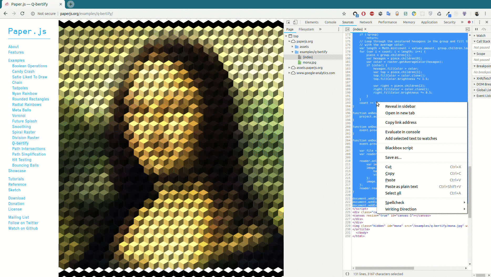
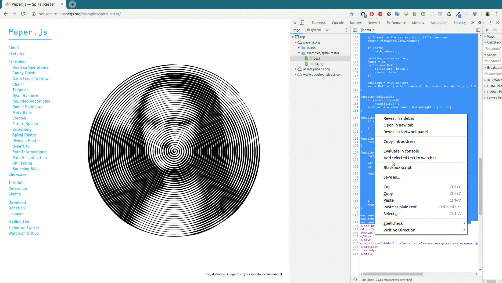
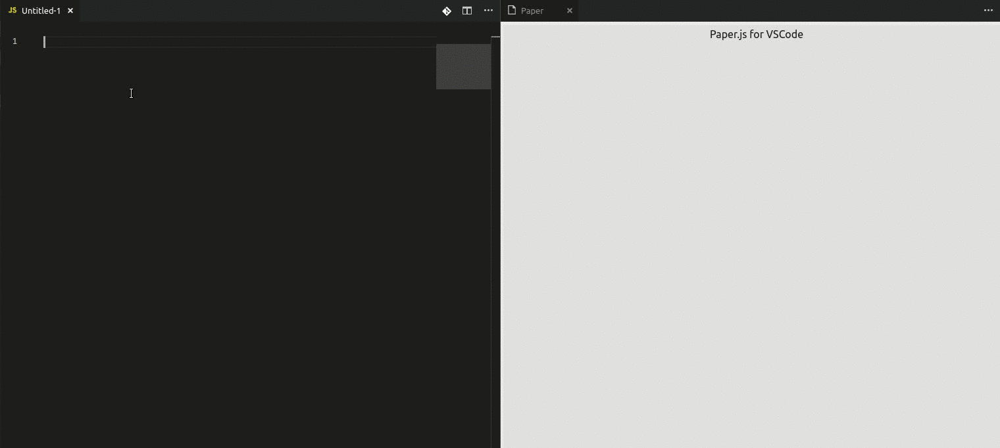

# vscode-paper

Extension that allows you to use paper.js right in your VSCode with live reloading  
It uses `paper.js` ([website](http://paperjs.org/), [repository](https://github.com/paperjs/paper.js)) of version `0.11.5` from [cdnjs](https://cdnjs.com/libraries/paper.js/0.11.5) ( *paper-full.min.js* )  

---

## Examples

## Features

1. Live reloading
2. ES6 syntax support

## Installation

`ext install vscode-paper`

## Usage

### Using Command Palette (CMD + Shift + P)

`CMD + Shift + P -> Create a Paper`

## TODOs

1. Add grid and ability to change it's size/color/show coordinates on hover/whatever...
2. Add ability to pan view in any direction
3. Add typings for paper.js in order to use autocompletion
4. ?